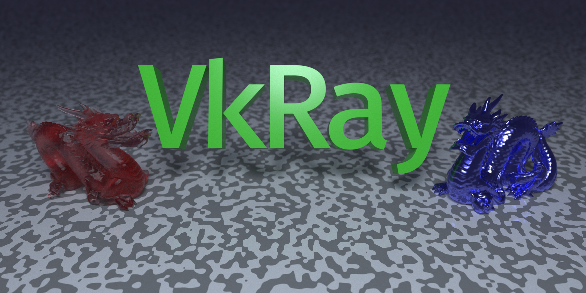
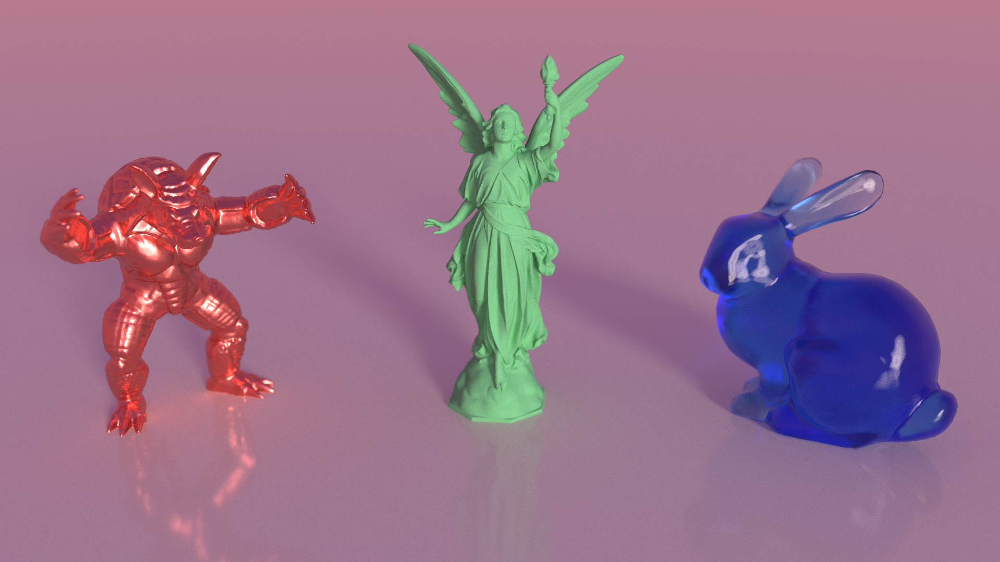
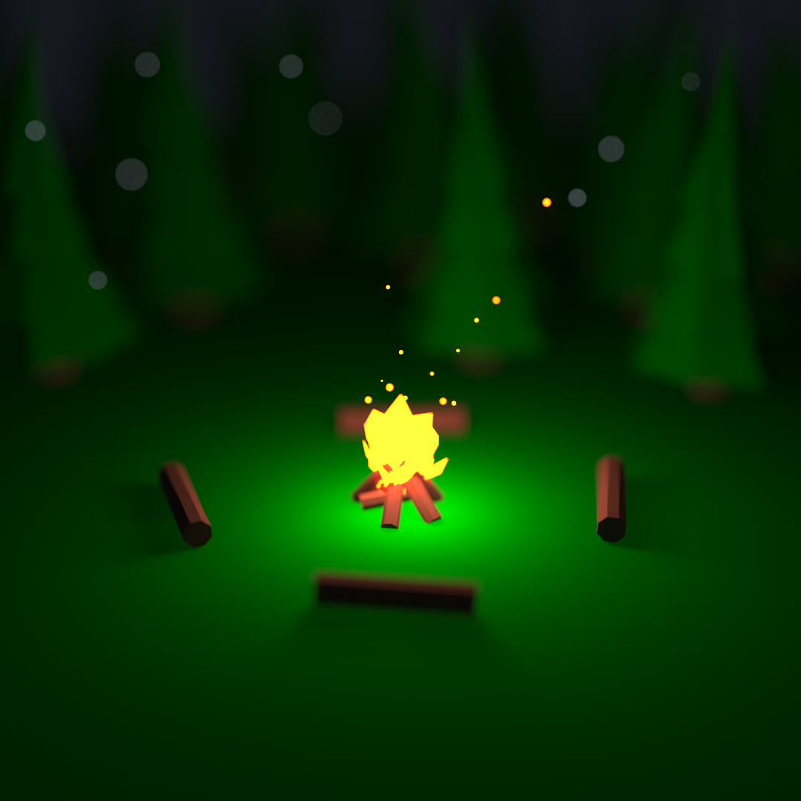

# VkRay

A Vulkan path tracer with an interactive scene editor.




<p align="center">
  
  
</p>

## Path Tracer

Unidirectional path tracing with next-event estimation and multiple importance sampling. SAH BVH for mesh acceleration. Russian roulette and variance-based adaptive sampling.

**BSDFs** — Lambertian, GGX metal, GGX glossy, Principled (metalness, roughness, transmission, IOR), Dielectric, homogeneous participating media (Beer-Lambert, Henyey-Greenstein, volume NEE).

**Geometry** — Sphere, plane, box, quad primitives; OBJ meshes with smooth shading, mesh simplification, and per-group vertex colors from MTL.

## Scene Editor

Interactive editor with transform gizmos, material and parameter inspector, orbital camera with depth-of-field, and full scene serialization to/from JSON (see [`docs/scene-format.md`](docs/scene-format.md)).

## Build

Requires CMake and a C++20 compiler, plus the following system dependencies:
- [Vulkan SDK](https://vulkan.lunarg.com/) — set `VULKAN_SDK` to the SDK root
- [GLFW3](https://www.glfw.org/)
- [GLM](https://github.com/g-truc/glm)

ImGui, FontAwesome, nfd, nlohmann/json, stb_image, tinyexr, and tinyobjloader are bundled in `third_party/`.

```bash
cmake -S . -B build
cmake --build build
./build/vkRay
```

Shaders are compiled from GLSL at runtime via `glslc` and cached as `.spv` in `build/`. Bumping `VERSION` triggers an automatic reference render.

## Structure

```
src/
  application.cpp     — main loop, parameter init
  app/                — context, parameters, input, animation
  scene/              — ECS, primitives, serializer, editor UI
  render/             — render handler, export
shaders/
  pathtracing/        — BVH traversal, BSDFs, NEE, AOVs
  compositing.glsl    — accumulation blend and denoising
  frag.glsl           — display pass and debug views
res/
  scenes/             — JSON scene files
  models/             — OBJ mesh assets
docs/                 — scene format, expression syntax
```

Built on [VkSmol](libs/VkSmol), a self-contained Vulkan engine submodule that owns the render graph, pipelines, buffers, and platform abstraction.

## Roadmap

Active areas: renderer/editor decoupling, OIDN integration, BDPT, texture support. See [`PLAN.md`](PLAN.md).

*[Antonin Granados](https://github.com/antoningranados)*
