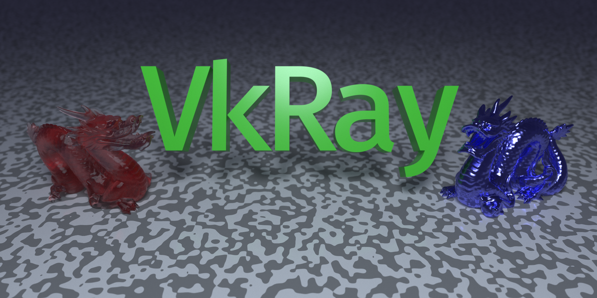
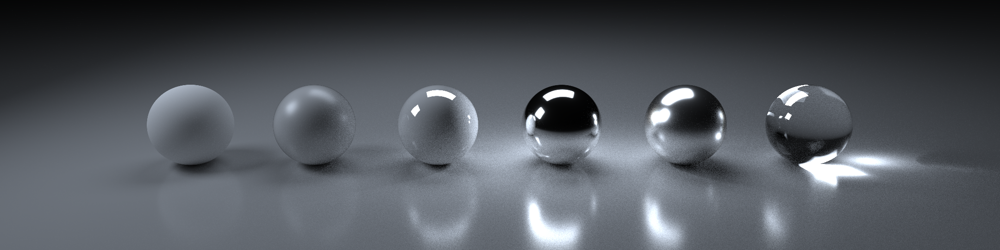
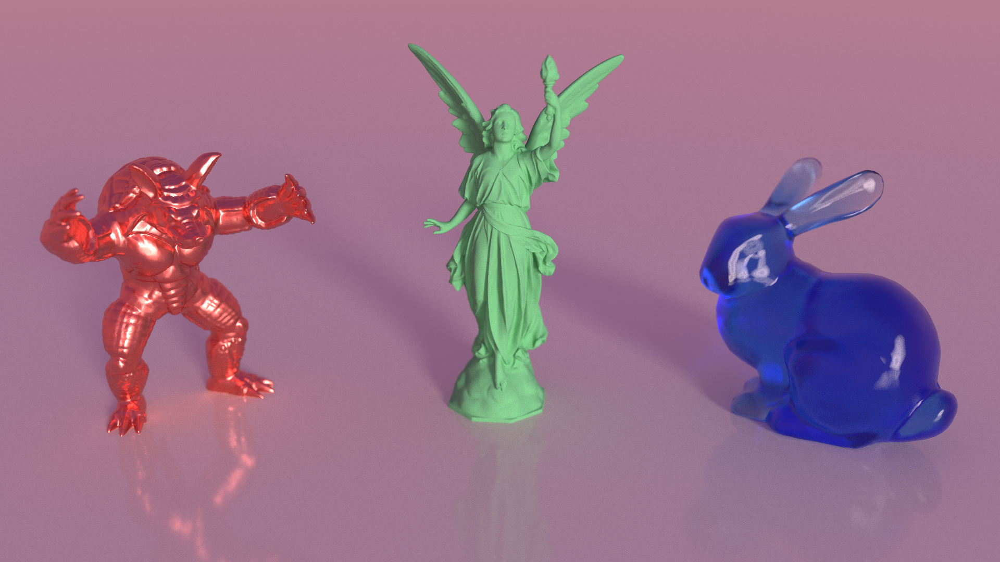
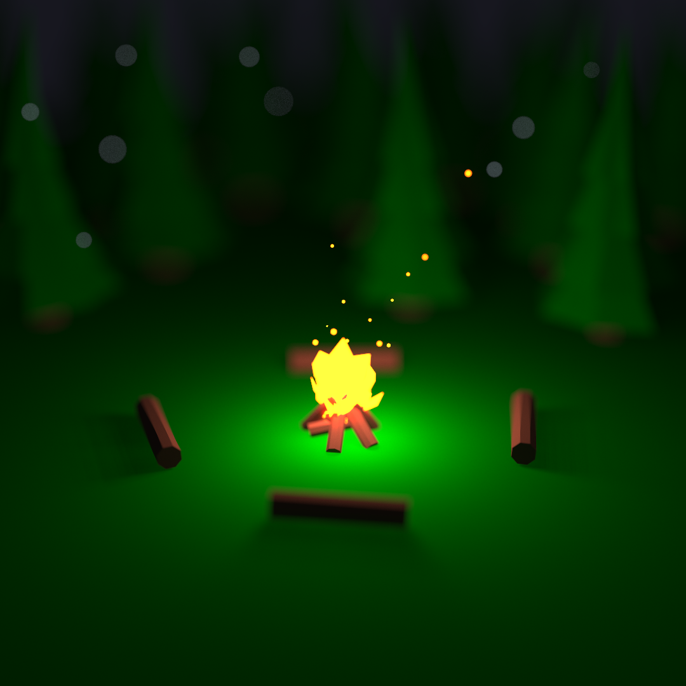

# VkRay

A Vulkan path tracer with an interactive scene editor.




<p align="center">
  
  
</p>

## Path Tracer

Unidirectional path tracing with next-event estimation and multiple importance sampling. SAH BVH for mesh acceleration. Russian roulette and variance-based adaptive sampling.

**BSDFs**: Lambertian, GGX metal, GGX glossy, Principled (metalness, roughness, transmission, IOR), Dielectric, homogeneous participating media (Beer-Lambert, Henyey-Greenstein, volume NEE).

**Geometry**: Sphere, plane, box, quad primitives; OBJ meshes with smooth shading, mesh simplification, and per-group vertex colors from MTL.

**Programmable shaders**: materials, skies, camera lenses and compositing passes can be written as small GLSL-based scripts (`assets/materials/`, `assets/environment/`, `assets/camera/`, `assets/compositing/`), hot reloaded on save.

## Scene Editor

Interactive editor with transform gizmos, material and parameter inspector, orbital camera with depth-of-field, and full scene serialization to/from JSON (see [`docs/scene-format.md`](docs/scene-format.md)).

## Build

Requires CMake 3.20+, a C++26 compiler with `#embed` support (Apple Clang 21, Clang 19+, GCC 15+), and the [Vulkan SDK](https://vulkan.lunarg.com/) (set `VULKAN_SDK` to the SDK root).

```bash
git clone --recursive git@github.com:AntoninGranados/VkRay
cmake -S . -B build
cmake --build build
./build/VkRay
```

Dependencies are vendored in `external/`: VkSmol (with GLFW, ImGui, shaderc), GLM, nfd, nlohmann/json, stb_image, tinyexr, tinyobjloader, FontAwesome and doctest.

The executable is self-contained: built-in shaders, parameters, fonts, apertures and the default scene are embedded at build time, and shaders are compiled in memory at runtime via `shaderc`. Scenes, models and programmable shader scripts are loaded from disk. Logs are written to the OS log directory (`~/Library/Logs/VkRay` on macOS).

## Usage

```bash
./build/VkRay                                   # interactive editor
./build/VkRay --job assets/jobs/showcase.json   # headless render of a job file
./build/VkRay --generate-docs docs              # regenerate docs/parameters.md and docs/components.md
```

Job files are described in [`docs/job-format.md`](docs/job-format.md).

## Structure

```
src/
  application.cpp     : entry point, editor/offline mode selection
  core/               : Core singleton, ECS, scene + serializer, animation, renderer, shader plugins
  editor/             : editor UI, panels, material preview
  offline/            : headless job queue
  utils/              : logging, file watching, builtin resources
  shaders/            : path tracing, compositing and editor GLSL
  config/             : parameter definitions
assets/
  scenes/             : JSON scene files
  models/             : OBJ mesh assets
  materials/, environment/, camera/, compositing/ : programmable shader scripts
  jobs/               : offline render jobs
docs/                 : scene format, expressions, jobs, parameters, components
tests/                : unit tests, golden-image regression, pre-commit hooks
```

Built on [VkSmol](external/VkSmol), a self-contained Vulkan engine submodule that owns the render graph, pipelines, buffers, and platform abstraction.

## Roadmap

Active areas: spectral rendering, BDPT, denoising, textures and HDRI environments, heterogeneous volumes. See [`PLAN.md`](PLAN.md).

*[Antonin Granados](https://github.com/antoningranados)*
